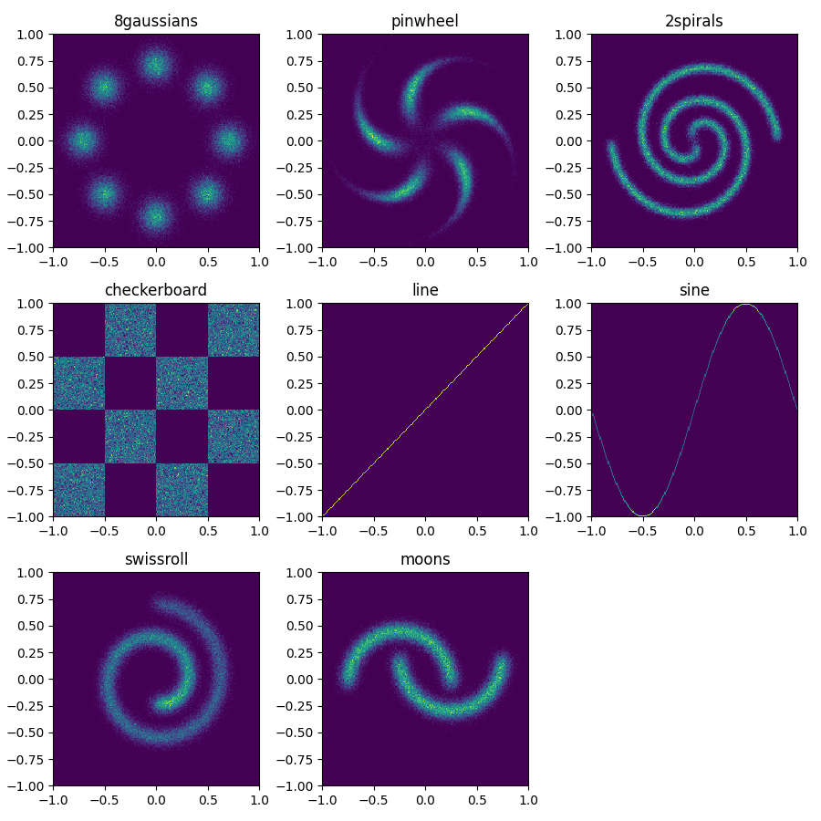

# Synthetic datasets

## 2D toy datasets



You can install the package from source by changing directory to the root of the repository and running:

```bash
pip install .
```

Then, to test your installation, simply run:

```bash
python scripts/visualize_all_2d.py
```

It should show all the 2D datasets as in the figure above.